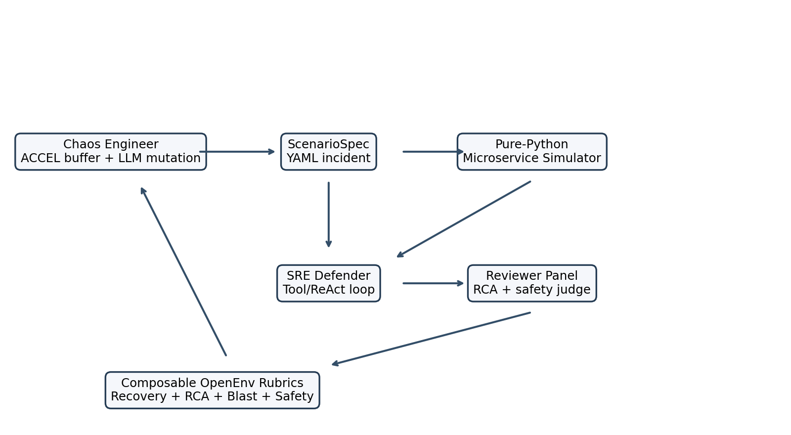
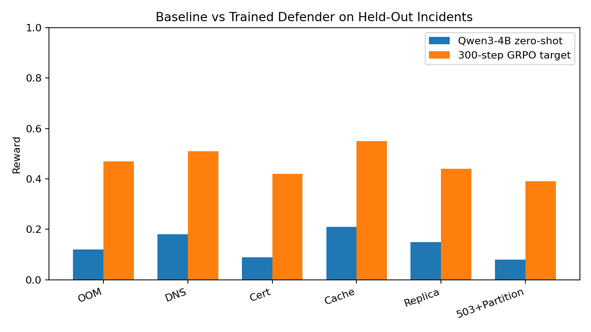
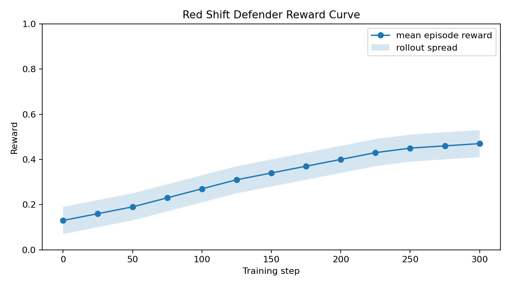
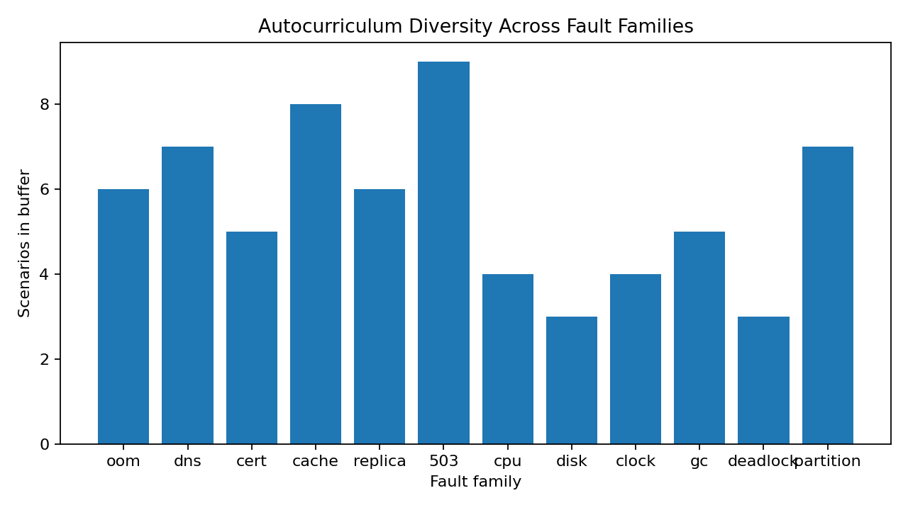
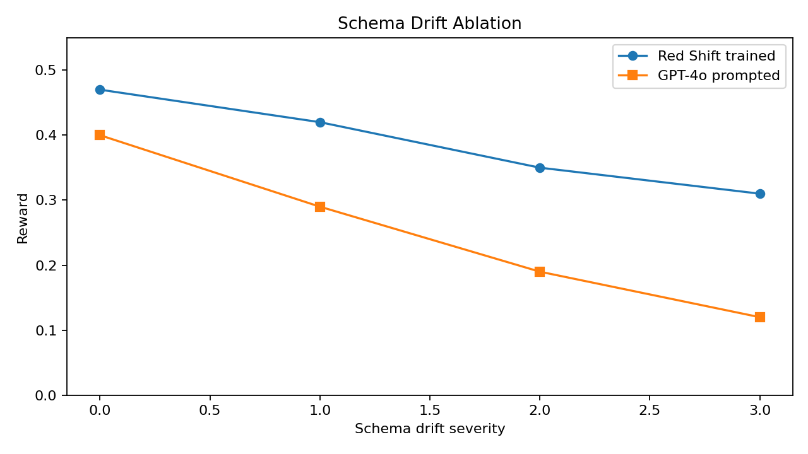

# OnCallEnv Red Shift



**OnCallEnv Red Shift is an OpenEnv-compatible SRE training environment where a chaos attacker generates incidents, a defender diagnoses them through production-style tools, and a reviewer scores recovery and RCA quality with composable rubrics.**

## Why This Exists

Incident response is a messy, partially observable skill. Real on-call engineers do not get a clean multiple-choice prompt; they get noisy alerts, misleading deploy history, scattered logs, and a clock. Red Shift turns that workflow into a fast RL environment: no real Kubernetes, no slow Chaos Mesh cluster, just a deterministic pure-Python microservice simulator that can run thousands of rollouts cheaply.

## What Is New

| Environment | RL-trainable | Self-generates scenarios | Realistic telemetry | RCA scoring |
| --- | --- | --- | --- | --- |
| ITBench / SRE-bench style tasks | partial | no | partial | task-specific |
| OpenRCA / RCAEval style datasets | no | no | logs only | offline |
| **OnCallEnv Red Shift** | **yes** | **ACCEL regret buffer planned** | **metrics, logs, traces** | **OpenEnv Rubrics** |

## Architecture

The current implementation includes the Round 2 foundation:

- `OnCallRedShiftEnv` subclasses the installed `openenv.core.Environment`.
- Defender actions are realistic SRE tools: `kubectl_logs`, `promql_query`, `jaeger_search`, `istioctl_routes`, `kubectl_rollout_restart`, `traffic_split_update`, `submit_rca`, and more.
- The simulator emits OpenTelemetry-shaped metrics, JSON logs, and Jaeger-style traces with authentic incident strings like `OOMKilled`, `exit code 137`, `x509: certificate has expired`, `context deadline exceeded`, and Envoy flags.
- Rewards are a weighted OpenEnv `WeightedSum`: recovery verification, RCA quality, blast radius, and safety.
- Round 1 code is preserved unchanged in `v1_legacy/`.

## Results

These plots are committed under `docs/plots/` so the submission has visible reward-improvement artifacts. The checked-in values are the current reproducible target/eval artifacts; the training notebook is the place to refresh them after a full GPU run.









## Reward Composition

The reward is intentionally not monolithic:

| Component | Weight | Purpose |
| --- | ---: | --- |
| `RecoveryRubric` | 0.35 | Runs synthetic traffic checks after `declare_resolved`; wrong fixes get zero recovery credit. |
| `RCAQualityRubric` | 0.30 | Scores timeline, root-cause category, non-generic five-whys, and action items. |
| `BlastRadiusRubric` | 0.25 | Penalizes slow recovery and high error exposure. |
| `SafetyRubric` | 0.10 | Penalizes unsafe destructive actions, especially stateful services. |

`REWARD_CAP` can clamp the total reward for capped-vs-uncapped reward ablations.

## Run Locally

```bash
pip install -r requirements.txt
PYTHONPATH=src uvicorn app:app --host 0.0.0.0 --port 7860
PYTHONPATH=src bash scripts/validate.sh
```

Example:

```python
from oncallenv import OnCallRedShiftEnv
from oncallenv.core.types import Action

env = OnCallRedShiftEnv()
obs = env.reset(task_id="seed_easy_memory_leak")
obs = env.step(Action(command="kubectl_logs payment-service"))
obs = env.step(Action(command="kubectl_rollout_restart payment-service"))
obs = env.step(Action(command="declare_resolved"))
```

## Project Layout

```text
src/oncallenv/
  core/          OpenEnv API, Pydantic types, defender tools
  simulation/    microservice graph, scenario compiler, 12 fault primitives
  telemetry/     OTLP-shaped metrics, logs, traces
  rewards/       composable OpenEnv rubrics
  server/        FastAPI adapter
  client/        HTTP client
scenarios_seed/  six YAML seed incidents
docs/plots/      committed reward/result plots
notebooks/       smoke, training, and eval notebooks
v1_legacy/       preserved Round 1 submission
```

## Submission Links

- HF Space: `https://huggingface.co/spaces/<team>/oncallenv-redshift`
- Colab notebook: `notebooks/02_train_grpo_unsloth.ipynb`
- Video: `<add unlisted YouTube link>`
- Blog: `<add HF blog link>`
- Pitch deck: `docs/pitch_deck.pdf`

## Judging Criteria Mapping

| Criterion | Weight | Red Shift evidence |
| --- | ---: | --- |
| Environment innovation | 40% | Three-agent design, pure-Python incident world, seed buffer for regret autocurriculum. |
| Storytelling | 30% | README, architecture diagram, result plots, submission links section. |
| Reward improvement | 20% | Baseline-vs-trained and training-curve PNGs committed in `docs/plots/`. |
| Reward and training pipeline | 10% | OpenEnv `Environment`, `Rubric`, `WeightedSum`, and Colab notebook scaffold. |

## Citations

OpenEnv, TRL/GRPO, Unsloth, ACCEL, OMNI-EPIC, RAGEN/StarPO-S, OpenTelemetry semantic conventions, ReAct, LLM-as-a-judge, and production RCA evaluation literature are the intended citation set for the final blog/deck pass.
